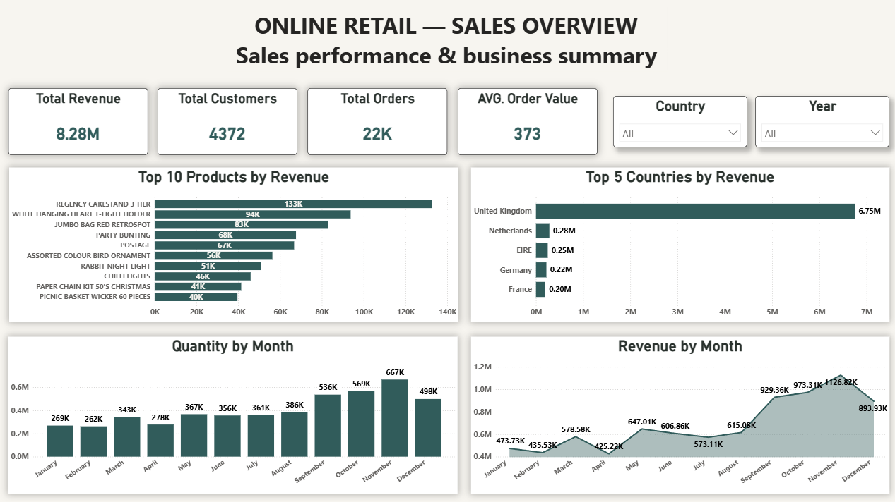
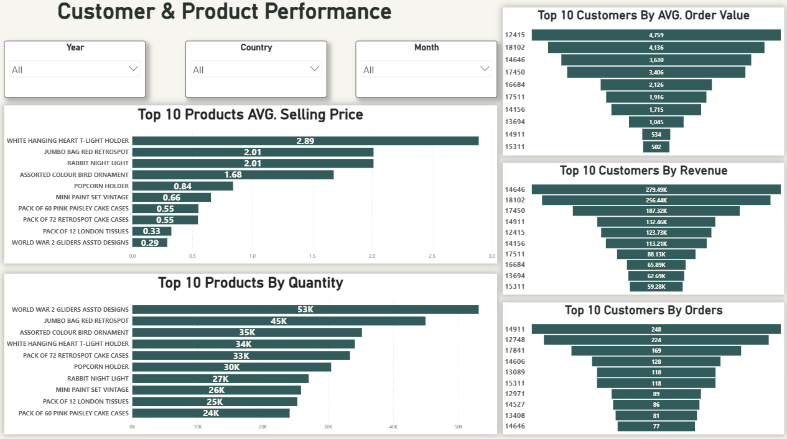
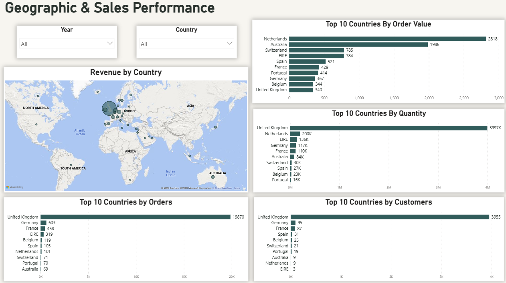

# Online Retail Sales Analytics

## 📊 Project Overview

This project presents an interactive Power BI dashboard designed to analyze online retail sales performance, customer behavior, product performance, and geographic sales performance.

The dashboard transforms raw sales data into meaningful business insights that help identify top-performing products, valuable customers, sales trends, and key markets.

## 🎯 Business Objectives

The main objectives of this project are to:

- Monitor overall sales performance.
- Identify top-performing products.
- Analyze customer purchasing behavior.
- Identify high-value customers.
- Analyze product quantity and pricing performance.
- Understand sales trends over time.
- Compare sales performance across different countries.

## 🛠️ Tools & Technologies

- Power BI
- DAX
- Python
- Data Cleaning & Transformation
- Data Visualization
- Business Intelligence

## 📈 Dashboard Pages

### 1. Executive Overview

This page provides a high-level overview of the overall business performance.

Key metrics and visuals include:

- Total Revenue
- Total Customers
- Total Orders
- Average Order Value
- Top 10 Products by Revenue
- Top 5 Countries by Revenue
- Quantity by Month
- Revenue by Month

### 2. Customer & Product Performance

This page provides a deeper analysis of customer behavior and product performance.

#### Customer Analysis

- Top 10 Customers by Revenue
- Top 10 Customers by Orders
- Top 10 Customers by Average Order Value

#### Product Analysis

- Top 10 Products by Quantity
- Top 10 Products by Average Selling Price

### 3. Geographic & Sales Performance

This page focuses on geographic performance and customer activity across different countries.

Key analysis includes:

- Top 10 Countries by Orders
- Top 10 Countries by Quantity
- Top 10 Countries by Customers
- Average Order Value by Country

## 🔍 Business Questions

This dashboard helps answer questions such as:

- What is the total revenue generated?
- Which products generate the highest revenue?
- Which countries contribute the most revenue?
- Who are the highest-value customers?
- Which customers place the most orders?
- Which products have the highest sales volume?
- Which countries have the highest number of orders?
- Which countries have the highest customer base?
- How does revenue change over time?
- Which countries have the highest average order value?

## 💡 Key Insights

The dashboard enables users to quickly identify:

- High-performing products and customers.
- Countries with strong sales performance.
- Changes in revenue and quantity over time.
- Differences between customer order frequency and customer value.
- Products with higher average selling prices.
- Geographic differences in customer activity and order behavior.

## 📷 Dashboard Preview

### Executive Overview

### Customer & Product Analysis

### Sales & Geographic Analysis

## 📁 Project Files

- `.pbix` — Power BI dashboard file
- `.png` — Dashboard screenshots
- `README.md` — Project documentation

## 👨‍💻 Author

**Mahmoud Sameh**

Data Analyst | Power BI | SQL | Python | Excel

---

⭐ If you find this project useful, feel free to explore the dashboard and connect with me on LinkedIn.
